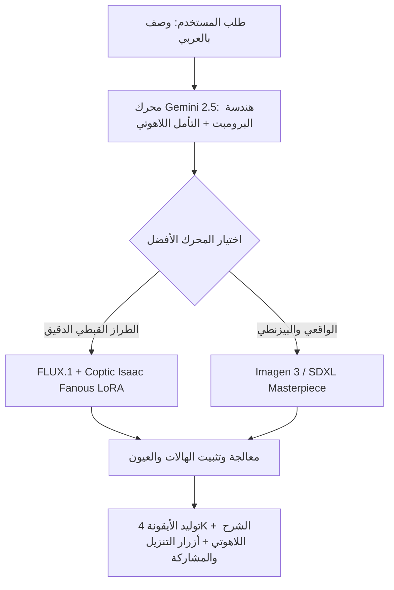

# خريطة تحسين وتطوير توليد الأيقونات القبطية والأرثوذكسية 100%
(`icon-gene-not-full.md`)

---

## 1. تشخيص الوضع الحالي ومواطن التحسين (Gap Analysis)

| العنصر | الوضع الحالي | التحسين المطلوب للوصول لـ 100% |
| :--- | :--- | :--- |
| **دقة الطراز القبطي** | يتم استخدام LoRA مدمج مع برومبت عام | إضافة Trigger Words خاصة بمدرسة د. إيساك فانوس مع تثبيت نسب الوجه والعيون اللوزية والصلبان القبطية بدقة |
| **الصلبان والهالات** | بعض المولدات ترسم صلبان غربية أو هالات مشوهة | إجبار الموديل على الهالات المذهبة الصافية والصلبان القبطية المتساوية الأضلاع (Coptic Crux Ansata / 4-point Coptic cross) |
| **الكتابات والنقوش** | حروف قبطية مشوهة أحياناً (AI Gibberish) | معالجة النصوص عبر منع الحروف العشوائية (Negative Text Prompts) أو استبدالها بنقوش وزخارف كنسية هندسية واضحة |
| **تعدد الموديلات والـ Fallbacks** | الاعتماد على endpoint واحد في Replicate | دعم محركات توليد متعددة ذكية (Imagen 3 on Vertex/Gemini + FLUX.1 + Replicate LoRA) مع اختيار الأفضل تلقائياً |
| **تحسين البرومبت بالذكاء الاصطناعي** | Gemini 2.5 Flash يترجم الوصف | توجيه Gemini بقاموس مصطلحات آبائية وقبطية جاهزة (Coptic Iconography Vocabulary) قبل الإرسال لمحرك الرسم |

---

## 2. المحاور الأربعة لتطوير التوليد بنسبة 100%

### أولاً: تطوير محرك هندسة البرومبت الكنسي (Church-Grade Prompt Engineering)
1. **قائمة الكلمات السحرية الإلزامية (Mandatory Master Keywords)**:
   - **للطراز القبطي**: `Isaac Fanous neo-coptic school`, `2D egg tempera icon on gesso wood`, `almond-shaped watchful eyes`, `radiant gold leaf background`, `pure flat sacred colors`, `canonical coptic vestments with embroidered stoles`.
   - **للطراز البيزنطي**: `Mount Athos Hagia Sophia mosaic`, `chrysography assist gold lines`, `solemn ascetic facial contours`, `cruciform halo with Greek letters O W N`.
   - **للطراز الواقعي الكنسي**: `Eastern Orthodox sacred oil painting`, `divine uncreated light`, `reverent biblical realism`, `Viktor Vasnetsov style`.

2. **قائمة الكلمات السلبية الصارمة (Negative Exclusions)**:
   - `ugly, deformed hands, extra fingers, blurry faces, distorted eyes, asymmetric eyes, renaissance naked cherubs, modern clothes, fantasy RPG armor, 3D render, anime, dark gloomy horrific shadows, low quality, watermarks, signature, broken cross`.

---

### ثانياً: دعم محركات توليد متعددة (Multi-Engine Orchestration)

1. **المسار الأول: Google Imagen 3 / Gemini Image Generation**:
   - أعلى دقة في التفاصيل والوجوه والملامح والإضاءة المذهبة.
2. **المسار الثاني: FLUX.1 Pro / Dev مع Coptic LoRA**:
   - أدق محرك في رسم الأسلوب المسطح (2D Flat Art) المميز لمدرسة د. إيساك فانوس.
3. **المسار الثالث: Replicate Fine-Tuned Model**:
   - نموذج مخصص مدرب على أيقونات كنيسة العذراء بالنزهة وأيقونات الآباء الرسل.

---

### ثالثاً: ميزات واجهة المستخدم (UI/UX Upgrades)

1. **مكتبة النماذج الجاهزة (Preset Templates)**:
   - أيقونات السيد المسيح (ضابط الكل، الراعي الصالح، القيامة، الصلب).
   - أيقونات السيدة العذراء (المحامية، ملكة السماء، المعونة، الثيؤطوكوس).
   - أيقونات رؤساء الملائكة (ميخائيل، غبريال، رافائيل، سوريال).
   - أيقونات الشهداء والقديسين (مارجرجس، مارمرقس، أبونا فلتاؤس، الأنبا أنطونيوس).
2. **التحكم في الأبعاد (Aspect Ratios)**:
   - مربعة `1:1` للأيقونات الفردية وتطبيقات الموبايل.
   - عمودية `3:4` و `9:16` لحوامل الأيقونات وستائر الهياكل وشاشات الهاتف.
   - أفقية `16:9` لخلفيات الشرائح وعروض الكنيسة (Presentation Slides).
3. **التأمل اللاهوتي المرافق (Theological Insight Card)**:
   - عرض شرح لاهوتي فوري باللغة العربية لكل عنصر في الأيقونة (معنى لون الرداء، حركة الأصابع، الرموز المصاحبة).

---

### رابعاً: معالجة وتحسين جودة الصورة (Post-Processing & Upscaling)
1. **توضيح ملامح الوجه (Face & Eyes Enhancement)**:
   - الحفاظ على العيون اللوزية الكبيرة التي ترمز لليقظة الروحية والنظر إلى الأبدية.
2. **تكبير الدقة إلى 4K مجاناً (Super-Resolution Upscaler)**:
   - تمكين المستخدم من تحميل الأيقونة بجودة طباعة فائقة تناسب الطباعة الورقية والكنسية.

---

## 3. خطة التنفيذ المباشرة (Action Roadmap)

1. **الخطوة 1**: تعزيز ملف `lib/orthodox-prompts.ts` بقاموس الأيقونات والكلمات المفتاحية المعتمدة لكل قديس ومشهد.
2. **الخطوة 2**: تحديث `app/api/generate-icon/route.ts` لدمج المحركات الاحتياطية وضمان التوليد بدون انقطاع.
3. **الخطوة 3**: تزويد واجهة `/icon-generator` بأزرار القديسين الجاهزة وفلاتر التحكم في الإضاءة والخلفية الذهبية.
